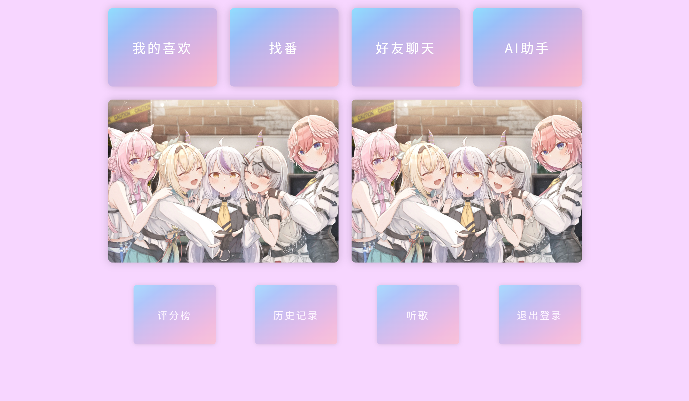
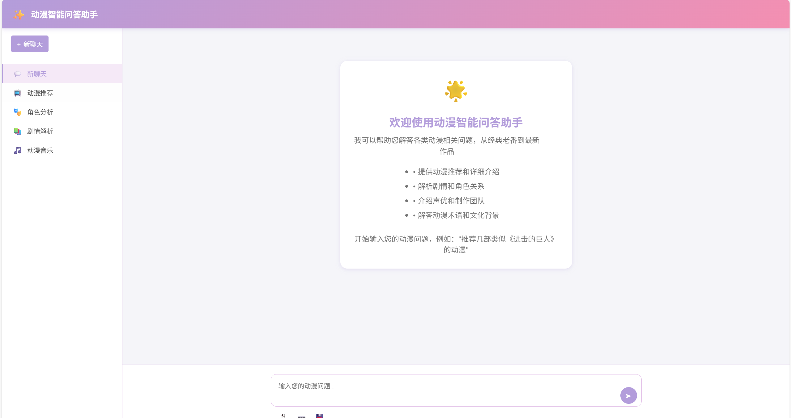
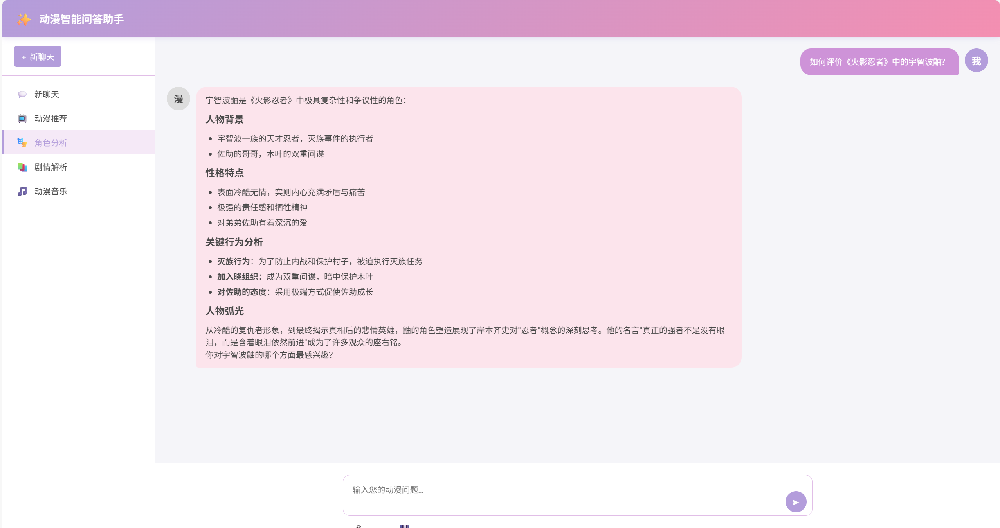
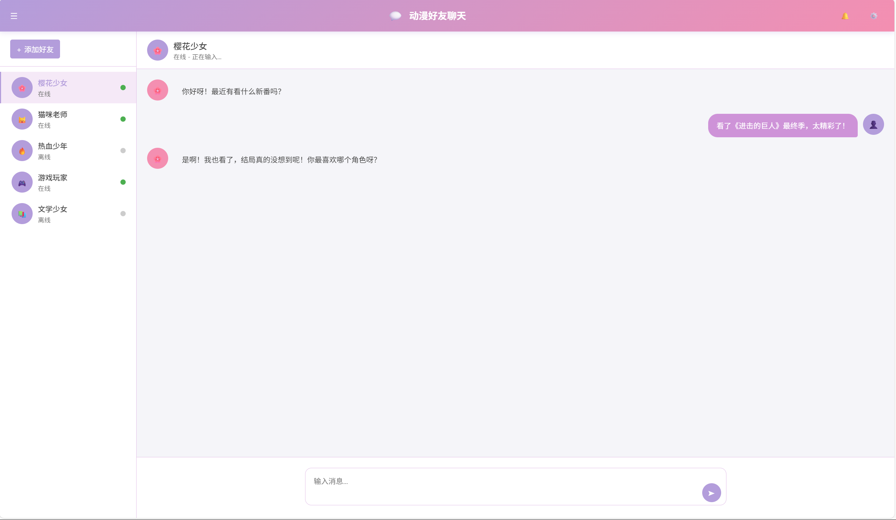
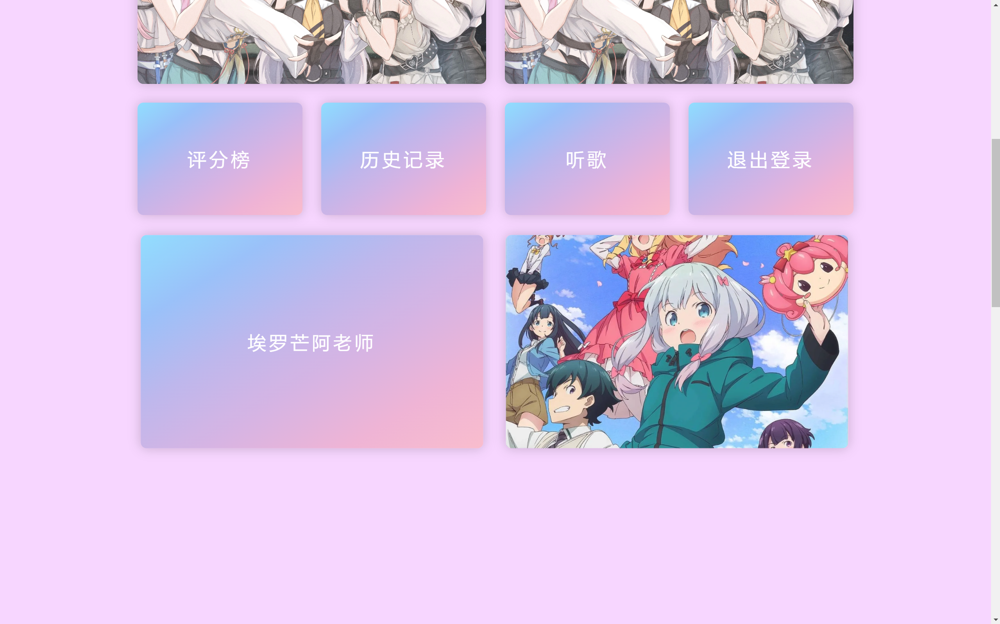

# AIChat 动漫交友平台项目文档（完善中）

## 一、项目概述
本项目围绕动漫领域开发了一个名为 AIChat 的小助手，主要聚焦于动漫推荐和交流相关问题，能为用户提供实用建议，帮助用户轻松找到心仪动漫，畅快融入动漫交流圈。

## 二、项目结构
项目主要包含以下几个模块：
1. **AIChat**：核心模块，基于 Spring Boot 构建，集成 langchain4j-community-dashscope-spring-boot-starter 提供 AI 对话能力 🤖，实现动漫推荐、话题解析等核心功能。
2. **User**：用户模块，处理用户信息管理、认证授权 🔐，依赖 Spring Boot、MySQL、Redis 及 JWT 实现无状态登录与安全验证。
3. **Message**：消息模块，支持用户实时互动 💬，基于 MyBatis-Plus 操作数据库，通过 Kafka 实现消息异步传递，集成 Caffeine+Redis 双层缓存提升响应速度。
4. **video**：视频资源模块，管理动漫视频元数据 🎥，依赖 MinIO 实现文件存储，Elasticsearch 提供高效检索，Kafka 处理异步任务，Redisson 实现分布式锁。

## 三、功能特性
1. **提供具体动漫推荐建议**：针对不同需求（如按类型、年代、口碑等），推荐口碑佳作，包括经典老番和热门新番，附带简要推荐理由和看点。
2. **给出动漫相关活动参与全流程指南**：例如漫展打卡攻略、动漫主题活动报名技巧、线上动漫社群加入方法等。
3**分享热门动漫讨论点和交流技巧**：解析当下热门动漫的关键剧情、角色争议点，传授在交流中表达观点、避免冲突的小窍门。

## 四、项目优点
### （一）技术层面
1. **现代化的开发框架**：使用 Spring Boot 3.5.3 作为基础框架，提供了自动配置和快速开发的能力，减少了开发人员的配置工作，提高了开发效率。
2. **丰富的依赖库**：引入了多个实用的依赖库，如 `langchain4j-community-dashscope-spring-boot-starter` 可利用其强大的语言处理能力，`mybatis-plus-boot-starter` 简化了数据库操作，`minio` 用于文件存储等，使项目功能更强大。
3. **多模块架构**：采用多模块的架构设计，将不同功能模块分离，如 User、Message、video 等，提高了代码的可维护性和可扩展性，便于团队协作开发。
4. **支持注解处理**：通过配置编译器的注解处理，能够自动生成代码，减少手动编写样板代码的工作量，提高代码质量。

### （二）功能层面
1. **全面的动漫推荐覆盖**：涵盖经典老番与热门新番，从不同维度（类型、年代、口碑等）提供推荐，满足用户多样化的动漫查找需求。
2. **详细的活动指南**：涵盖动漫相关活动的全流程指南，为用户参与动漫活动提供了便利，增加了用户的参与度。
3. **实用的交流支持**：分享热门动漫的讨论点和交流技巧，有助于用户更好地参与动漫交流，提升用户体验。

## 五、项目缺点
### （一）技术层面
1. **依赖过多**：项目引入了较多的依赖库，可能会导致项目的复杂度增加，版本兼容性问题也可能随之出现，增加了维护成本。
2. **性能问题**：使用多个第三方服务和数据库，如 MySQL、MinIO、Kafka、Elasticsearch 和 Redisson 等，可能会带来性能瓶颈，尤其是在高并发情况下，需要进行性能优化。
3. **学习成本**：对于新加入的开发人员来说，需要了解多个模块和依赖库的使用，学习成本较高。

### （二）功能层面
1. **数据准确性**：动漫推荐的准确性依赖于用户提供的信息和数据的质量，如果用户信息不准确或数据不完整，可能会影响推荐的效果。
2. **更新及时性**：动漫行业发展迅速，新番不断推出，热门动漫的讨论点也在不断变化，项目需要及时更新数据和信息，以保证推荐和讨论的及时性。
3. **用户交互体验**：目前文档中未提及项目的用户交互界面和方式，可能存在用户交互体验不佳的问题，需要进一步优化。

## 六、使用说明
### （一）环境要求
- Java 17 ☕
- Maven 3.6+ 🛠️
- MySQL 8.0+ 🛢️ 
- Redis 6.2+ 🗄️ 
- Kafka 3.0+（可选，消息模块依赖）📨 
- Elasticsearch 7.14+（可选，检索功能依赖）🔍 
- MinIO RELEASE.2023-05-04T21-44-30Z+（可选，文件存储依赖）🗄️ 
- Nacos 2.2.3（服务注册与配置中心）🔧

### （二）项目启动（前端页面风格借鉴了 b站山羊的前端小窝 ，遂不开源）
1. 克隆项目代码到本地：git clone https://github.com/dajier666/mini-bilibili.git
2. 进入项目根目录，执行 mvn clean install 编译打包 📦 
3. 配置 Nacos 服务地址及各模块数据库连接参数 ⚙️ 
4. 依次启动依赖服务（MySQL、Redis、Kafka 等）🚀 
5. 启动各模块 Spring Boot 应用： 
6. AIChat 模块：java -jar AIChat/target/AIChat-0.0.1-SNAPSHOT.jar 
7. User 模块：java -jar User/target/User-0.0.1-SNAPSHOT.jar 
8. 其他模块启动方式类似

